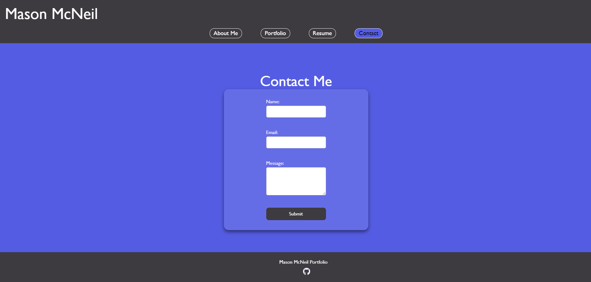

# React Portfolio

## Description

This is a Portfolio project using react. You can see resume, projects, contact me, and an about me.

## Table of Contents

1. [Installation](#installation)
2. [Usage](#usage)
3. [License](#license)
4. [Contributing](#contributing)
5. [Tests](#tests)
6. [Questions](#questions)

## Installation

Copy the repo on to your computer and git clone in terminal.

## Usage

Run npm install to install all dependencies.Next npm run dev to start the app on your local computer

Deployed App: https://meek-maamoul-b734d9.netlify.app/

## License

This project is licensed under the MIT license. See the [MIT License]([License](https://opensource.org/licenses/MIT)) for details.

## Contributing

n/a

## Tests

n/a

## Questions

For questions about the project, please feel free to contact me via GitHub: [masonamc5](https://github.com/masonamc5) or via email at masonamc5@gmail.com.
